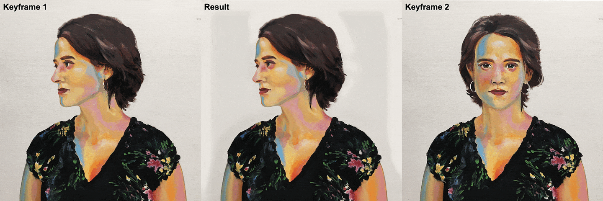

# Interactive Video Stylization Using Few-Shot Patch-Based Training

The official implementation of

> **Interactive Video Stylization Using Few-Shot Patch-Based Training** </br>
_[O. Texler](https://ondrejtexler.github.io/), [D. Futschik](https://dcgi.fel.cvut.cz/people/futscdav),
[M. Kučera](https://www.linkedin.com/in/kuceram/), [O. Jamriška](https://dcgi.fel.cvut.cz/people/jamriond), 
[Š. Sochorová](https://dcgi.fel.cvut.cz/people/sochosar), [M. Chai](http://www.mlchai.com), 
[S. Tulyakov](http://www.stulyakov.com), and [D. Sýkora](https://dcgi.fel.cvut.cz/home/sykorad/)_ </br>
[[`WebPage`](https://ondrejtexler.github.io/patch-based_training)],
[[`Paper`](https://ondrejtexler.github.io/res/Texler20-SIG_patch-based_training_main.pdf)],
[[`BiBTeX`](#CitingFewShotPatchBasedTraining)]




## Run

Download the [testing-data.zip](https://drive.google.com/file/d/1EscSNFg4ILpB7dxr-zYw_UdOILLmDlRj/view?usp=sharing), and unzip. The _train folder is expected to be next to the _gen folder.

### Pre-Trained models
If you want just quickly test the network, here are some [pre-trained-models.zip](https://drive.google.com/file/d/11_lCPqKDAtkMQTCSNTKBu2Sii8km_04s/view?usp=sharing).
Unzip, and follow with the Generate step. Be sure to set the correct --checkpoint path when calling `generate.py`, e.g., `_pre-trained-models/Zuzka2/model_00020.pth`.


### Train
To train the network, run the `train.py` 
See the example command below:

```
train.py --config "_config/reference_P.yaml" 
		 --data_root "Zuzka2_train" 
		 --log_interval 1000 
		 --log_folder logs_reference_P
```

Every 1000 (log_interval) epochs, `train.py` saves the current generator to logs_reference_P (log_folder), and it validates/runs the generator on _gen data - the result is saved in Zuzka2_gen/res__P


### Generate
To generate the results, run `generate.py`. 

```
generate.py --checkpoint "Zuzka2_train/logs_reference_P/model_00020.pth" 
	    --data_root "Zuzka2_gen"
	    --dir_input "input_filtered"
	    --outdir "Zuzka2_gen/res_00020" 
	    --device "cuda:0"
```


## Installation
Tested on Windows 10, `Python 3.7.8`, `CUDA 10.2`.
With the following python packages:
```
numpy                  1.19.1
opencv-python          4.4.0.40
Pillow                 7.2.0
PyYAML                 5.3.1
scikit-image           0.17.2
scipy                  1.5.2
tensorflow 	       1.15.3 (tensorflow is used only in the logger.py, I will remove this not-necessary dependency soon)
torch                  1.6.0
torchvision            0.7.0
```

## TODO
* Add code for "interactive" usedcase as shown in the paper.
* Remove the dependency on tensorflow.


## Credits
* This project started when [Ondrej Texler](https://ondrejtexler.github.io/) was an intern at [Snap Inc.](https://www.snap.com/), and it was funded by [Snap Inc.](https://www.snap.com/) and [Czech Technical University in Prague](https://www.cvut.cz/en)
* The main engineering forces behind this repository are [Ondrej Texler](https://ondrejtexler.github.io/), [David Futschik](https://dcgi.fel.cvut.cz/people/futscdav), and [Michal Kučera](https://www.linkedin.com/in/kuceram/).


## License
* The Patch-Based Training method is not patented, and we do not plan on patenting. 
* However, you should be aware that certain parts of the code in this repository were written when [Ondrej Texler](https://ondrejtexler.github.io/) and [David Futschik](https://dcgi.fel.cvut.cz/people/futscdav) were employed by [Snap Inc.](https://www.snap.com/). If you find this project useful for your commercial interests, please, reimplement it.


## <a name="CitingFewShotPatchBasedTraining"></a>Citing
If you find Interactive Video Stylization Using Few-Shot Patch-Based Training useful for your research or work, please use the following BibTeX entry.

```
@Article{Texler20-SIG,
    author    = "Ond\v{r}ej Texler and David Futschik and Michal Ku\v{c}era and Ond\v{r}ej Jamri\v{s}ka and \v{S}\'{a}rka Sochorov\'{a} and Menglei Chai and Sergey Tulyakov and Daniel S\'{y}kora",
    title     = "Interactive Video Stylization Using Few-Shot Patch-Based Training",
    journal   = "ACM Transactions on Graphics",
    volume    = "39",
    number    = "4",
    pages     = "73",
    year      = "2020",
}
```

